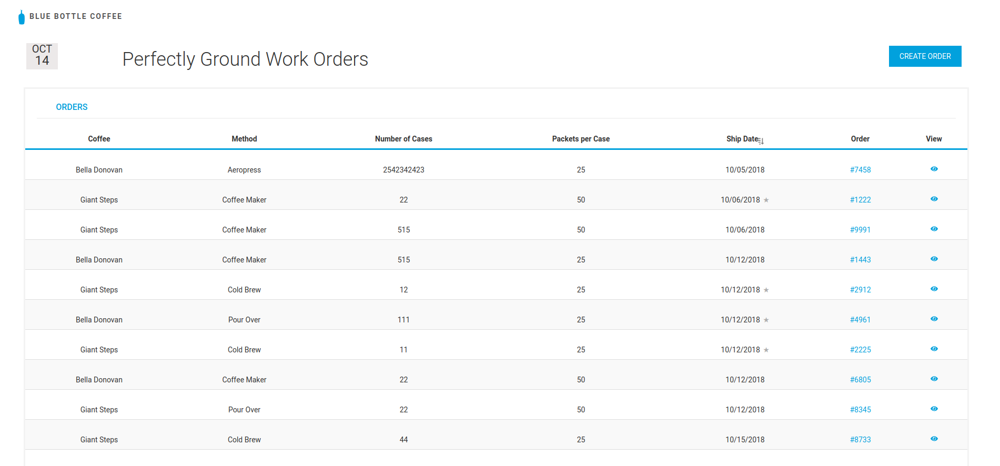
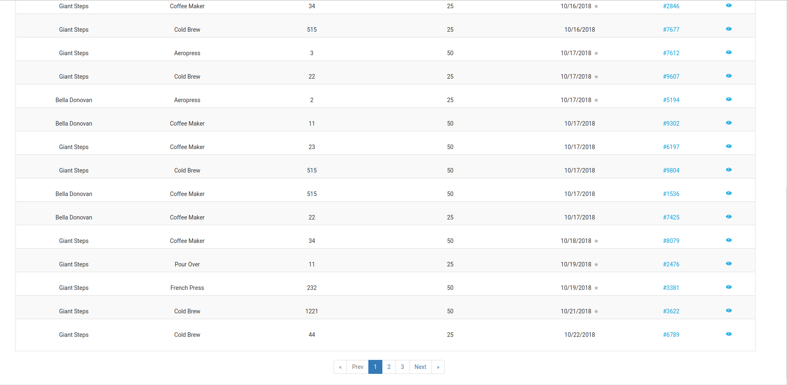
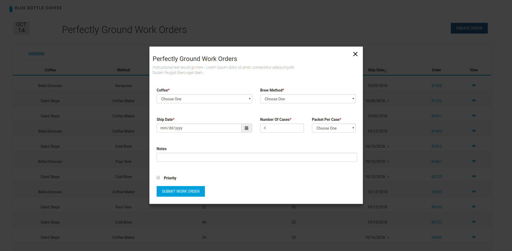
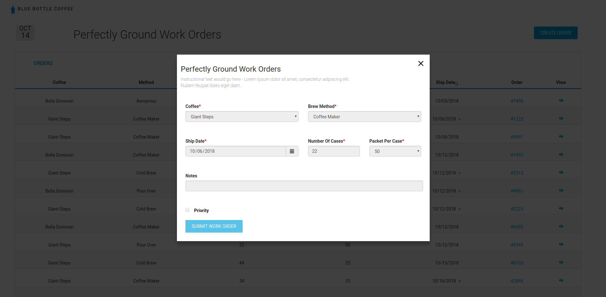

<h1>PGOS - [Perfectly Ground Ordering System]</h1>
<h2>Architecture</h2>

This application was created by using React JS for frontend, Node JS with Express JS framework for Backend 
and MongoDB for Database. The following subtopics describe the architecture of this web application in detail.

<h3>FrontEnd </h3>
1. The React JS Application is made up of multiple reusable components. 

2. The root component is composed of multiple child components to render the whole Application.

3. There are different components like Button, TableView, Modal, etc.

4. As soon as the application loads, it gets all the orders from the server in JSON format and renders it in a table view format.

5. The user can also post a JSON request to the server to create a new order.

6. The users also has the ability to view the order in detail by clicking the view button.

<h3>Backend</h3> 
1. The server is running on Node JS library using the Express Framework.

2. There are two REST API EndPoints for (POST) creating an order or (GET) getting all orders.

3. For creating an order, a JSON is sent to the first endpoint which in turn parses it and saves it in the database.

4. The getting all the orders, the server queries the database, then sorts it according to the shipping date and priority in ascending order and sends it back in a JSON format.

<h3>Database</h3>
1. The database is running on MongoDB which is deployed on MLAB.

2. There is only one Model for this application.

3. The schema was defined by using mongoose.

4. The schema for the database is defined in the following format:

`    orderId: {
         type: String
     },
     coffeeName: {
         type: String
     },
     brewMethod: {
         type: String
     },
     shipDate: {
         type: String
     },
     numberOfCases: {
         type: Number
     },
     priority: {
         type: Boolean
     },
     packetsPerCase: {
         type: Number
     },
     notes: {
         type: String
     }`
     
<h2>Trade OFFs</h2>
 I had two options to build this project.
 
1. Build a server with Node JS and serve React JS application as Static files.

2. Create the React JS and Node JS application separately using `Create React App` and `npm install express-generator -g`.

I chose option 2 because its the fastest way to rapidly prototype an application. All the dependencies and boilerplate are pre installed for you
and you can quickly start developing the application, whereas with option 1, I will have to manually install all the dependencies and also figure out a way to make an
express application render a static react application which can also transpile a JSX application to normal JS.

Also with option 2, I had to deal with CORS and the best way to deal with that was to enable my server to accept CORS.

<h2>Run the project</h2>
<strong>Prerequisite: Make sure that you have Node JS with NPM installed in your system.
 </strong>
 
The following steps will let you download and run the project locally: 

1. Open up a terminal and clone the repository using  `git clone https://github.com/vmal/PGOS.git`.

2. `cd` into the cloned dir and `cd` again into Client Directory.

3. Type `npm install` to install all the dependencies and then `npm start` to run the Client Server. Your default browser should open up with the client running at `locahost:3000`.

4. Open another instance of terminal and this time `cd` into Server Directory.

5. Type `npm install` to install all the dependencies and then `node app.js`.

6. Your server will be running on port `4000`.

7. Since the database is already deployed on cloud in Mlab, you will not have to worry about it.

7. You can now successfully interact with the application!

<h2>Deployment And Production Readiness</h2>

To deploy the application, we have to first run the `npm build` in the React App directory to make the app production ready. 
Then we can use the following two ways to deploy the 
app since the frontend and backend part of this 
application will be running separately:
1. <b>AWS: </b> Deploy the react app on amazon's s3 bucket or elastic beanstalk and deploy the express js application on amazon's elastic beanstalk.
2. <b>Heroku:</b> You can easily upload both the frontend and backend application separately on heroku or spin up two dynos to run it from one application.

I would choose option 2 for rapid prototyping since I would not have to deal with making IAM accounts and setting up different 
security and dependencies manually to run both the applications for option 1. Whereas, with heroku, I can quickly upload the application through the terminal and Heroku, will take care of it all.

 <h2>Screenshot</h2>

 

 

 

